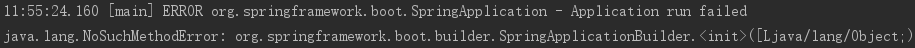
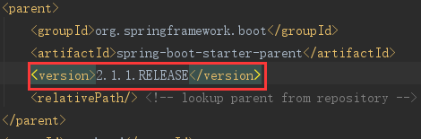
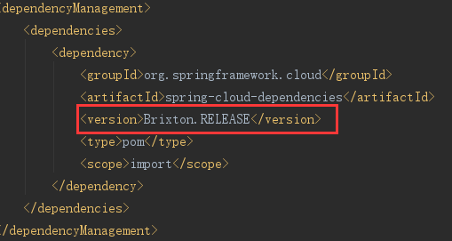
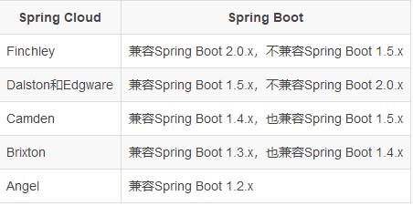

#### 1.springboot启动时出现的错误：



#### 原因：

##### 由于springboot的版本和springcloud的版本不匹配

##### 这里我使用的springboot的版本为：



##### springcloud的版本为：



##### 解决办法：

##### 				springboot vs springcloud版本




#### 2.服务不能注册

##### 启动服务时，在控制台最后几句中并没有出现如下提示：

```she
registration status: 204
```

##### 则表明该服务没有成功注册到注册中心。

##### 解决不能注册的方法：(排错步骤)

1. 查看本服务的POM文件中是否有服务提供者依赖

   ##### springboot2.0及以上版本：

   ```xml
   <dependency>
       <groupId>org.springframework.cloud</groupId>
       <artifactId>spring-cloud-starter-netflix-eureka-client</artifactId>
   </dependency>
   ```

   ##### springboot2.0以下版本：

   ```xml
   <dependency>
       <groupId>org.springframework.cloud</groupId>
       <artifactId>spring-cloud-netflix-eureka-client</artifactId>
   </dependency>
   ```

2. 查看服务启动类上是否加了@EnableEurekaClient注解（**springboot2.0以上**）或者@EnableCircuitBreaker注解

3. 查看application.properties文件中是否配置了该服务的端口号和注册中心的地址。

   ```properties
   server.port=该服务的端口号
   eureka.client.serviceUrl.defaultZone=注册中心的地址
   ```

4. 试完上述方法如果还不行，那就可能是springboot版本问了。

#### 3.注册zuul时出现如下错误：

```shell
Description:

The bean 'counterFactory', defined in class path resource [org/springframework/cloud/netflix/zuul/ZuulServerAutoConfiguration$ZuulCounterFactoryConfiguration.class], could not be registered. A bean with that name has already been defined in class path resource [org/springframework/cloud/netflix/zuul/ZuulServerAutoConfiguration$ZuulMetricsConfiguration.class] and overriding is disabled.

Action:

Consider renaming one of the beans or enabling overriding by setting spring.main.allow-bean-definition-overriding=true

```

##### 原因：

版本不兼容，我当前的springboot版本是2.1.x   

##### 解决办法：

把springboot版本降到2.0.x（我是降到2.0.7后重启可用）

#### 4.访问指定服务时出现404错误

##### 原因：

可能是因为所请求的资源放错了目录，因为SpringBoot项目的Bean装配默认规则是根据Application类所在的包位置从上往下扫描。

##### 解决办法:

将带有请求映射路径的资源文件放在与启动类（Application类）同级目录或者是放在启动类的下级目录。